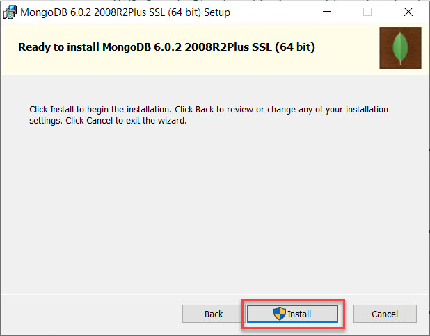

# MongoDB - Comandos Basicos

<p align="center">
<a href="https://www.mongodb.com/" target="_blank" rel="Drako01">  </a>
</p>

## Mongo Server (MSI)

<https://www.mongodb.com/es>

## Mongo Shell (MSI)

<https://www.mongodb.com/try/download/shell>

## Mongo Database Tools (MSI)

<https://www.mongodb.com/try/download/database-tools>

### Pasos instalación





### Instalación MONGO Shell

Siguiente, siguiente...

### Instalación MONGO Tools

Siguiente, siguiente...

### Instalación conEmu

<https://conemu.github.io/>


## Verificar que mi ambiente este OK

### MongoD (Servidor)

```sh
mongod --version # verifico que mi servidor instalado y configurado
```

**Nota:** si el comando no es encontrador. Colocar la carpeta de los binarios en las variables de entorno del sistema operativo. Colocar en el path.

```sh
C:\Program Files\MongoDB\Server\6.0\bin
```

### Mongo Shell (Cliente)

```sh
mongosh --version # verifico que tenga instalado y configurado
```

### MONGO DB Tools

```sh
mongodump --version # verifico que tenga instalado y configurado
```

**Nota:** si el comando no es encontrador. Colocar la carpeta de los binarios en las variables de entorno del sistema operativo. Colocar en el path.

```sh
C:\Program Files\MongoDB\Tools\100\bin
```

---

## Levantar el servidor

<https://www.mongodb.com/docs/manual/reference/program/mongod/>

```sh
mongod
```

**IMPORTANTE:** Si no queda tomada la consola. Tengo que crear los siguientes (directorios/carpetas). C:\data\db (O sea crear data dentro del disco C: y dentro de data la carpeta db)

> Levantar MongoD en una carpeta personalizada

```sh
mongod --dbpath="D:\mis_bases_de_datos\nombre"
```

## Cliente para conectar al servidor

Acuerdense que tiene que estar levantado el servidor **mongod**

```sh
mongosh
```

> Si no lo tengo levantado el error:

```sh
Current Mongosh Log ID: 637ead1554cbe0578d0d7099
Connecting to:          mongodb://127.0.0.1:27017/?directConnection=true&serverSelectionTimeoutMS=2000&appName=mongosh+1.5.4
Using MongoDB:          6.0.2
Using Mongosh:          1.5.4
```

## Drivers para las diferentes tecnologías

<https://www.mongodb.com/docs/drivers/>

## SQL vs NoSQL


## Collections and Documents


# Interactuando con la DB

## Listar DB

```sh
show dbs
```

## Crea DB o cambia a la DB

```sh
use <nombre-de-la-base-de-datos>
use db-mongo
```

**Nota**: Tener en cuenta que la base de datos se crea en memoria hasta que no se crea alguna colección.

## Crear una colección

Nota: Tengo que estar posicionado dentro de la DB. A la cual le quiero agregar una colección

```sh
# Creo una colección en forma implicita
db.createCollection('<nombre-de-colección>')
db.createCollection('productos')
```

## insertOne(): Me inserta un documento.

```sh
# Creo una colección en forma explicita
db.<nombre-colección>.insertOne({})
db.productos.insertOne({nombre: 'TV', precio: 1234})
```

## insertMany(): Me inserta varios documentos

```sh
db.clientes.insertMany([{},{},{}]) # Tengo que colocar los documentos dentro de un ARRAY
db.productos.insertMany(
    [
        {nombre: "Heladera", precio: 231},
        {nombre: "Microondas", precio: 2331},
        {nombre: "Monitor", precio: 3233},
        {nombre: "Notebook", precio: 2311},
        {nombre: "Zapatilla", precio: 441},
    ]
)
```

# OBJECTID

Cada vez que inserto un documento, se crea automaticamente el ObjectID. Este filed es único. No se repite.

<https://www.mongodb.com/docs/manual/reference/method/ObjectId/>

> Conversor de ObjectID a Timestamp
> <https://nddapp.com/object-id-to-timestamp-converter.html>

## find(): Listo todos los documentos de una colección o con un objeto filtro a traves de un patrón.

```sh
db.clientes.find() # Me lista todos los documentos dentro de la colección clientes
db.clientes.find({})
```

## find(): Con filtro

```sh
db.productos.find({ nombre: 'Cocina' })
```

## find(): Filtro con una regular expresion

```sh
db.productos.find({ nombre: /cocina/i }) # Utilizo una regex para buscar tanto en mayuscula como en minuscula cocina
```

> Otra forma de hacer filtros con regex

<https://www.mongodb.com/docs/manual/reference/operator/query/regex/>

```sh
db.productos.find(
    {
        nombre: {
            $regex: 'cocina',
            $opciones: 'i'
        }
    }
)
```

# REGEXP o REGEX (Expresiones regulares | regular expression)

<https://regexr.com/>
<https://regex101.com/>

---

# Repasamos:

## Levantar el servidor local

```sh
mongod
```

> Otra manera de levantar el servidor local

```sh
mongod --dbpath="D:\mis_bases_de_datos\nombre"
```

## Conectar al servidor local.

Se conecta por defecto a esta URI: <mongodb://127.0.0.1:27017/>

```sh
mongosh
```

## Mostrar DBs

```sh
show dbs
```

## Listar collections dentro de DB

```sh
show collections
```

## Para saber en que collections estoy parado.

```sh
db
```

## find(): Me permite busqueadas a partir filtros

```sh
db.usuarios.find({nombre: /o$/}) # Todos los que terminan con o
```

```sh
db.usuarios.find({nombre: /^A/}) # Todos los que empiezan con A
```

> Ejemplo de uso con $regex

```sh
const search = 'A'
```

```sh
db.usuarios.find(
    {
        nombre: {
            $regex: `^${search}`,
            $options: 'i' # No es obligatorio pero le puedo pasar optiones (Flags)
        }
    }
)
```

# Logical Query Operators

<https://www.mongodb.com/docs/manual/reference/operator/query/and/>

## $and (Operador Y lógico)

```sh
db.usuarios.find(
    {
        $and: [
            {nombre: 'Adrian'},
            {edad: 23}
        ]
    }
) # Si los patrones de búsqueda se cumplen va a mostrar los documentos que cumplen con ambas
```

## $or (Operador O lógico)

```sh
db.usuarios.find(
    {
        $or: [
            {nombre: 'Adrian'},
            {edad: 27}
        ]
    }
) # Busca uno u otro de los patrones. No necesariamente se tienen que cumplir ambos patrones
```

# Comparison Query Operators

## $gt: Más grande que...

<https://www.mongodb.com/docs/manual/reference/operator/query/gt/>

```sh
db.usuarios.find(
    {
        edad: { $gt: 29 }
    }
) # Busca en el field edad los mayores a 29
```

## $gte: Más grande o igual que...

```sh
db.usuarios.find(
    {
        edad: { $gt: 29 }
    }
) # Busca en el field edad los mayores e iguales a 29
```

## lt: Menor a...

```sh
db.usuarios.find(
    {
        edad: { $lt: 29 }
    }
) # Busca en el field edad los menores a 29
```

## lte: Menor o igual a...

```sh
db.usuarios.find(
    {
        edad: { $lte: 29 }
    }
) # Busca en el field edad los menores o iguales a 29
```

## $ne: Distinto del patrón que búsque

```sh
db.usuarios.find(
    {
        nombre: {
            $ne: 'Gabriel'
        }
    }
)
```

## $in: Todos los valores que le indique dentro de un array...

```sh
db.usuarios.find(
    {
        edad: {
            $in: [24, 27, 26]
        }
    }
)
```

## $nin: Todos los valores contrarios a lo que le indique dentro de un array...

```sh
db.usuarios.find(
    {
        edad: {
            $nin: [24, 27, 26]
        }
    }
)
```

## sort(): Ordenamiento

```sh
db.usuarios.find({}).sort(
    {
        nombre: -1 # Todos los documentos ordenados de la z-a
    }
)
```

```sh
db.usuarios.find({}).sort(
    {
        nombre: 1 # Todos los documentos ordenados de la a-z
    }
)
```

> Caso de uso: Todos los documentos mayores a 26 ordenados de menor a mayor

```sh
db.usuarios.find(
    {
        edad: {
            $gte: 26
        }
    }
).sort(
        {
            edad: 1
        }
    )
```

## limit(): Me permite limitar la cantida de documentos filtrados.

```sh
db.usuarios.find({}).limit(3)
```

## skip(): Me permite descartar una cantidad de documento elegida.

```sh
db.usuarios.find({}).skip(3)
```

> Caso de uso: Hacer un paginado

```sh
db.usuarios.find({}).limit(5).skip(0)
```

# size(): Me cuenta la cantida dd edocumentos que me devuelve el find

```sh
db.usuarios.find().size()
```

# countDocuments(): Cantidad de documentos que tengo dentro de una colección

```sh
db.usuarios.countDocuments()
```

## find({}, {}): Es que admite un segundo objeto

Nota: Por defecto siempre muestra el ObjectID

```sh
db.usuarios.find({}, {edad: 1}) # Me muestra solo la edad con el ObjID.
db.usuarios.find({}, {nombre: 1, _id: 0}) # Solo muestra nombre
db.usuarios.find({}, {edad: 0, _id: 0}) # Solo muestra nombre
```

## Levantar ambiente de desarrollo local

```sh
mongod
```

> Si quiero levantar en una carpeta personalizada

```sh
mongod --dbpath="D:\mis_bases_de_datos\nombre"
```

## MONGOSH: Cliente para conectarnos a la DB (LOCAL)

```sh
mongosh
```

## Para ver las DB disponibles dentro de MONGOSH

```sh
show dbs
```

## MONGOSH: Cliente para conectarnos a la DB (REMOTA)

Ir a MONGO ATLAS y buscar en el cluster el botón CONNECT y elegir la opción de conexión MONGOSH

```sh
mongosh "mongodb+srv://digitalers.2xyfw8q.mongodb.net/<la-base-datos>" --apiVersion 1 --username <su-usuario>
```

> Ejemplo

```sh
mongosh "mongodb+srv://digitalers.2xyfw8q.mongodb.net/mybd" --apiVersion 1 --username mprincipe
```

## MONGO DB COMPASS

Abro Mongo DB Compass


La URI para conectarse:

> LOCAL

mongodb://localhost:27017

> REMOTO


## $exists: Verifica si un field/propiedad existe o no

```sh
db.usuarios.find(
    {
        nombre: {
            $exists: false # $exists en false me muestra todos los docuemntos que no tengan el field: nombre
            }
    }
)
```

```sh
db.usuarios.find(
    {
        edad: {
            $exists: true # $exists en true me muestra todos los docuemntos que tengan como field: edad
            }
    }
)
```

## BORRAR DOCUMENTOS

### deleteOne(): Me permite borrar un documento

El deleteOne, borra solo el primer documento que encuentre.

**IMPORTANTE**: Siempre hacer un FIND con el filtro que quiero utilziar y luego hacer DELETE

```sh
db.usuarios.deleteOne(
    {
        nombre: 'Gabriel' # Solo borra un usuario que coincida con el nombre Gabriel.
    }
)
```

### deleteMany(): Me permite borrar un documento

```sh
db.usuarios.deleteMany(
    {
        edad: {
            $gte: 28 # Borra todos los mayores o iguales de 28 años.
        }
    }
)
```

## EDITAR DOCUMENTOS (ACTUALIZAR DOCUMENTOS)

### updateOne(): Me permite actualizar un documento

Actualizar el primer documento que encuentre, si hay más documentos, solo actualiza el primero.

```sh
db.usuarios.updateOne({<filtro/busqueda>}, {<info-con-la-cual-quiero-actualizar-el-documento>})
```

#### $set: Me permite agregar fields

```sh
db.usuarios.updateOne(
    {edad: 24},
    {
        $set: {
            activo: true
        }
    }
) # Busca persona una persona con la edad: 24 y la actualiza
```

### updateMany(): Me permite actualizar varios documentos

```sh
db.usuarios.updateMany(
    {},
    {
        $set: {
            activo: true,
        }
    }
) # Sin filtro, intervengo sobre todos los documentos. (Le agrego el field: activo en true)
```

```sh
db.usuarios.updateMany(
    {},
    {
        $set: {
            altura: 1.7,
            peso: 85
        }
    }
) # Le agrego a todos los documentos, los fields altura y peso
```

> Otro ejemplo

```sh
db.usuarios.updateMany(
    {
        _id: ObjectId("6381528166a059a9557820aa")
    },
    {
        $set: {
            activo: false,
            altura: 1.8,
            peso: 95
        }
    }
) # Filtra por Obj ID y le actualiza los fields.
```

#### $unset: Me permite remover fields

```sh
db.usuarios.updateOne(
    {
        _id: ObjectId("6381528166a059a9557820aa")
    },
    {
        $unset: {
            peso: 95
        }
    }
) # Le quito el field peso a un documento en particular
```

## MONGO DATABASE TOOLS

### MONGODUMP

Crear un backup de mis bases de datos y colecciones

<https://www.mongodb.com/docs/database-tools/mongodump/>

```sh
mongodump --db <base-de-datos>
```

> Ejemplo

```sh
mongodump --db mybd
```

## BORRAR COLECCION

```sh
db.<nombre-coleccion>.drop
```

> Ejemplo

```sh
use mybd
db.usuarios.drop()
```

## MONGO RESTORE

Nos permite recuperar una backup desde la carpeta **dump**

<https://www.mongodb.com/docs/database-tools/mongorestore/>

```sh
mongorestore --nsInclude=<nombre-base-datos>.<coleccion> <carpeta-donde-tengo-los-dump>
```

```sh
mongorestore --db mybd dump\mybd
mongorestore --nsInclude=mybd.usuarios dump
mongorestore --nsInclude=mybd.* dump # Recupero de la DB mybd. Todas las colecciones
```

## MONGO IMPORT

```sh
mongoimport --db=mybd --collection=mock --jsonArray --file MOCK_DATA.json
```

## Levantar el servidor MONGODB

```sh
mongod
```

> Levantar MONGODB en un directorio particular

```sh
mongod --dbpath="./db-62313"
```

## Se conectan al servidor MONGODB

```sh
mongosh
```

> Conectarme a MONGO ATLAS

```sh
mongosh "mongodb+srv://digitalers.2xyfw8q.mongodb.net/edit" --apiVersion 1 --username mprincipe
```

## Conectarse vía extensión de VSC

- MongoDB for VS Code

## Conocer la base de datos que tengo activa

```sh
db
```

## MONGO RESTORE

```sh
mongorestore --nsInclude=<nombre-base-datos>.<collection> <carpeta-donde-tengo-los-dump>
```

### Ejemplo:

```sh
mongorestore --nsInclude=mybd.* dump # Todas las colecciones de DB, mybd
```

## MONGO IMPORT

```sh
mongoimport --db=mybd --collection=autos --jsonArray --file MOCK_DATA.json
```

> Si no es un json que tiene un array

```sh
mongoimport --db=mybd --collection=autos --file personas.json
```

# MOCK

Me permite generar json para utilizar de prueba en mis aplicaciones

<https://www.mockaroo.com/>
<https://mockapi.io/projects>

## Bajar desde un endpoint un json

```sh
wget -O personas.json https://615d8b5212571a00172076ba.mockapi.io/personas
```

## CURSORES

El cursor es un elemento que me permite ir obteniendo todos los documentos de una búsqueda, no en forma completa, sino de a paquete de documentos. El cursor una vez consumido, no tiene más información. Se agota!

```sh
let cursor = db.personas.find()
cursor.forEach(function(d) { print(d) }) # EN ALGUNAS VERSIONES ANTIGUAS NO REPRESENTE LA INFO
cursor.forEach(function(d) { printjson(d) })
cursor.forEach(function(d) { printjson(tojson(d)) }) # DEPRECADO PARA LAS ULTIMAS VERSIONES
cursor.forEach(printjson) # DEPRECADO PARA LAS ULTIMAS VERSIONES
```

## Cargando un archivo de query

```sh
load('cmd0.js')
```
